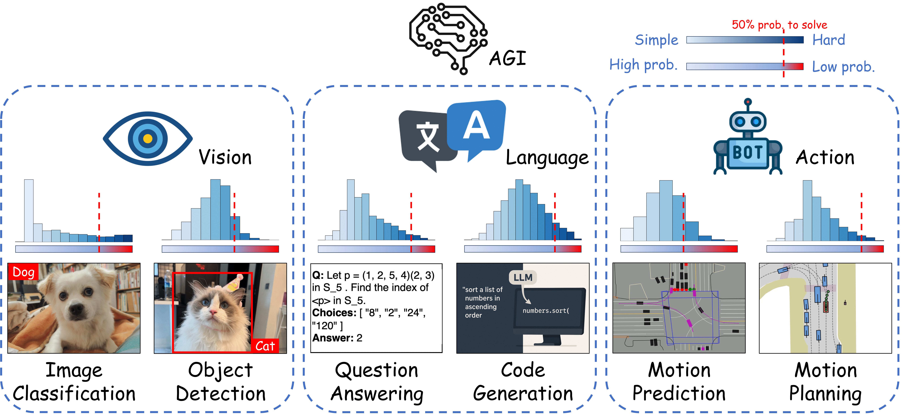
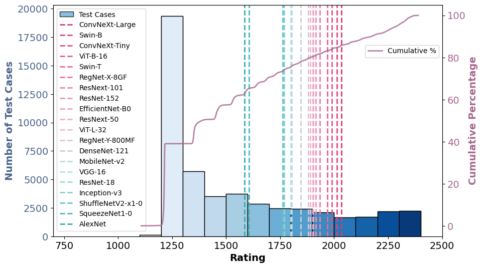
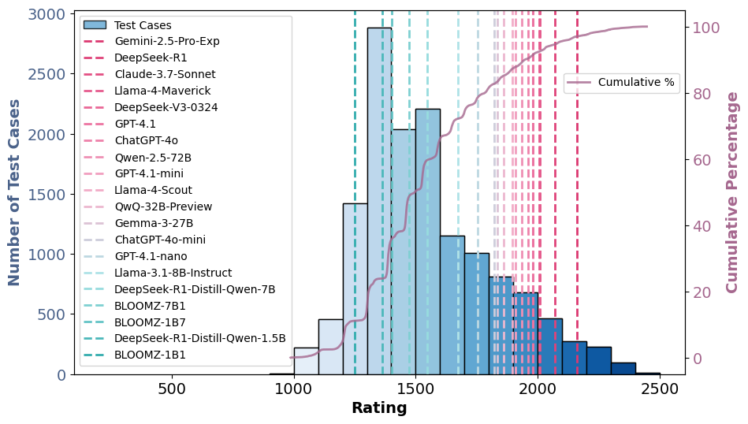
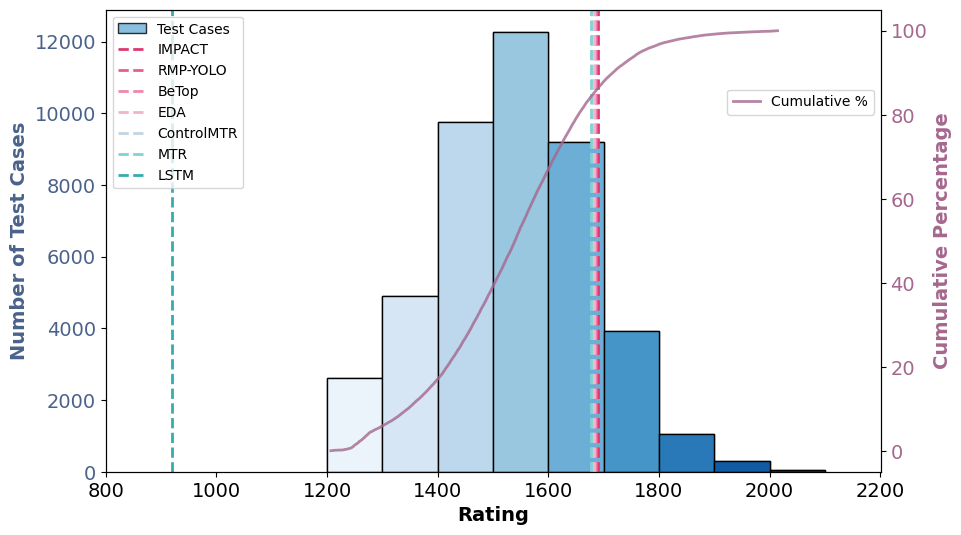
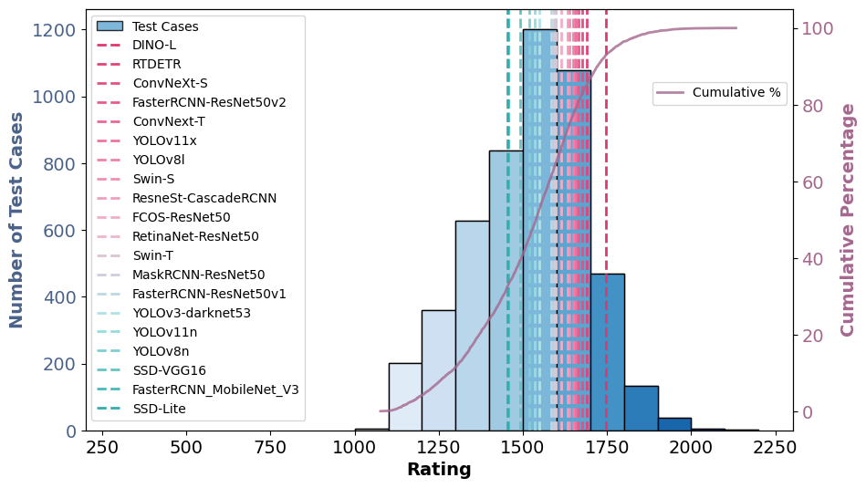
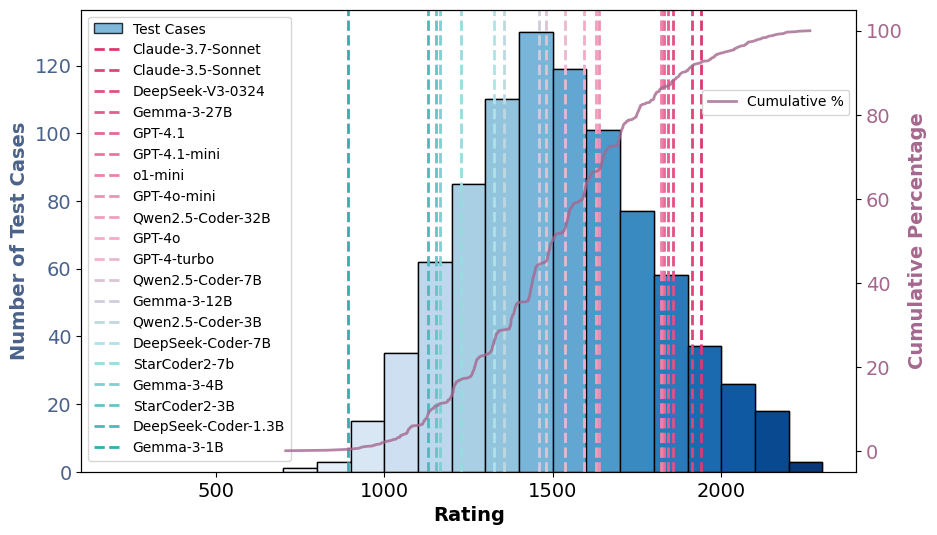
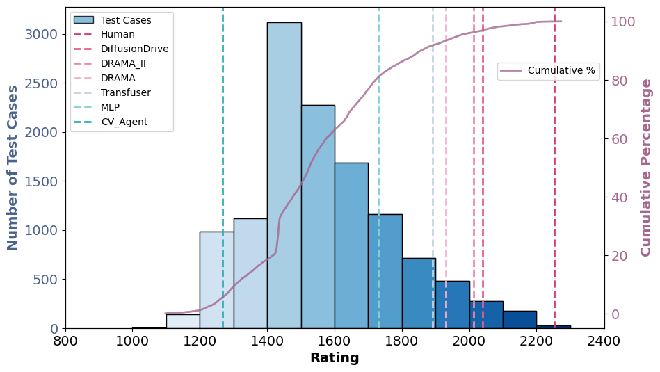

# AGI-Elo

**[[Project Page](https://ss47816.github.io/AGI-Elo/)] [[HuggingFace](https://huggingface.co/collections/ztony0712/agi-elo-6825d88e9587700e9dd41b12)] [[Preprint](https://arxiv.org/abs/2505.12844)] [[Code](https://github.com/SS47816/AGI-Elo)] [[Raw Data](https://drive.google.com/drive/folders/1Wpgeh6_FH-DRiPPVqbJYI3wTGNB4lbwk?usp=sharing)]**

## AGI-Elo: How Far Are We From Mastering A Task?

<!-- #### Quantifying Progress Toward Task Mastery with Elo Ratings -->

<div align="center">

_Shuo Sun<sup>1,3</sup>, Yimin Zhao<sup>1</sup>, Christina Dao Wen Lee<sup>1</sup>, Jiawei Sun<sup>1</sup>, Chengran Yuan<sup>1</sup>,<br>
Zefan Huang<sup>1,3</sup>, Dongen Li<sup>1,3</sup>, Justin KW Yeoh<sup>1</sup>, Alok Prakash<sup>3</sup>,<br>
Thomas W. Malone<sup>2,3</sup>, Marcelo H. Ang Jr.<sup>1,3</sup>_

_<sup>1</sup>National University of Singapore_ _<sup>2</sup>Massachusetts Institute of Technology_<br>
_<sup>3</sup>Singapore MIT Alliance for Research and Technology_

</div>

<!--  -->

<div align="center">
  <table>
    <tr>
      <td align="center">
         <br/>
         <sub><b>ImageNet</sub>
      </td>
      <td align="center">
         <br/>
         <sub><b>MMLU</sub>
      </td>
      <td align="center">
         <br/>
         <sub><b>Waymo</sub>
      </td>
    </tr>
    <tr>
      <td align="center">
         <br/>
         <sub><b>COCO</sub>
      </td>
      <td align="center">
         <br/>
         <sub><b>LiveCodeBench</sub>
      </td>
      <td align="center">
         <br/>
         <sub><b>NAVSIM</sub>
      </td>
    </tr>
  </table>
</div>


<!-- <div align="center">
  <table>
    <tr>
      <td align="center">
         
         <sub>Image classification: ImageNet</sub>
      </td>
         <td align="center">
         <sub>Question answering: MMLU</sub>
      </td>
         <td align="center">
         <sub>Motion prediction: Waymo</sub>
      </td>
    </tr>
    <tr>
      <td align="center">
         
         <sub>Object detection: COCO</sub>
      </td>
      <td align="center">
         
         <sub>Code generation: LiveCodeBench</sub>
      </td>
      <td align="center">
         
         <sub>Motion planning: NAVSIM</sub>
      </td>
    </tr>
  </table>
</div> -->

## Main Results

#### Rating distribution of datasets

You can go to our [Project Page](https://ss47816.github.io/AGI-Elo/) for a more detailed rating distribution analysis.

#### Test case difficulties and visualized samples

You can view the visualized test cases samples and their associated ratings on our [HuggingFace Collection](https://huggingface.co/collections/ztony0712/agi-elo-6825d88e9587700e9dd41b12) for all six datasets.

## Abstract

> As the field progresses toward Artificial General Intelligence (AGI), there is a pressing need for more comprehensive and insightful evaluation frameworks that go beyond aggregate performance metrics. This paper introduces a unified rating system that jointly models the difficulty of individual test cases and the competency of AI models (or humans) across vision, language, and action domains. Unlike existing metrics that focus solely on models, our approach allows for fine-grained, difficulty-aware evaluations through competitive interactions between models and tasks, capturing both the long-tail distribution of real-world challenges and the competency gap between current models and full task mastery. We validate the generalizability and robustness of our system through extensive experiments on multiple established datasets and models across distinct AGI domains. The resulting rating distributions offer novel perspectives and interpretable insights into task difficulty, model progression, and the outstanding challenges that remain on the path to achieving full AGI task mastery.

## Install

1. Clone this repository

```bash
git clone https://github.com/SS47816/AGI-Elo.git
cd AGI-Elo
```

2. Install all Dependencies

```bash
# Auto install conda env AGI_Elo
direnv allow
make install
conda activate AGI_Elo

# Auto install all pip dependencies from requirements.txt
make pip-install
```

## Usage

#### 1. Prepare model predictions

Each `.pkl` file should contain the prediction results of **one model evaluated across all test cases**.

You can download our precomputed prediction files from: [Google Drive: Raw Data](https://drive.google.com/drive/folders/1Wpgeh6_FH-DRiPPVqbJYI3wTGNB4lbwk?usp=sharing).

After downloading, organize the `./data` folder with the following structure:

```
   ./data
   ├── imagenet_class_index.json
   │
   ├── classification/
   │   ├── ImageNet/
   │       ├── val/
   │           ├── predictions/
   │           ├── ...
   │
   ├── detection/
   │   ├── COCO/
   │       ├── val/
   │           ├── predictions/
   │           ├── ...
   │
   ├── question_answering/
   │   ├── MMLU/
   │       ├── test/
   │           ├── predictions/
   │           ├── ...
   │
   ├── coding/
   │   ├── LiveCodeBench/
   │       ├── test/
   │           ├── predictions/
   │           ├── ...
   │
   ├── motion_prediction/
   │   ├── Waymo/
   │       ├── val/
   │           ├── predictions/
   │           ├── ...
   │
   ├── motion_planning/
   │   ├── NAVSIM/
   │       ├── val/
   │           ├── predictions/
   │           ├── ...
   │
```

---

#### 2. Run rating estimation

To run rating estimation across **all tasks and datasets**, use:

```bash
python3 AGI_Elo/scripts/run_all_experiments.py
```

Or optionally, you can run a specific task independently (e.g., classification):

```bash
python3 AGI_Elo/pipeline/classification.py
```

The results will be save to their respective `ratings/` folders.

## BibTeX

If you find our work interesting, please consider citing our paper:

    @misc{sun2025agielofarmasteringtask,
      title={AGI-Elo: How Far Are We From Mastering A Task?}, 
      author={Shuo Sun and Yimin Zhao and Christina Dao Wen Lee and Jiawei Sun and Chengran Yuan and Zefan Huang and Dongen Li and Justin KW Yeoh and Alok Prakash and Thomas W. Malone and Marcelo H. Ang Jr},
      year={2025},
      eprint={2505.12844},
      archivePrefix={arXiv},
      primaryClass={cs.AI},
      url={https://arxiv.org/abs/2505.12844}, 
    }

## License

This repository is licensed under the [Apache License 2.0](https://github.com/SS47816/AGI-Elo/blob/main/LICENSE)

<small><p>Project based on <a target="_blank" href="https://github.com/nestauk/ds-cookiecutter">Nesta's data science project template</a>
